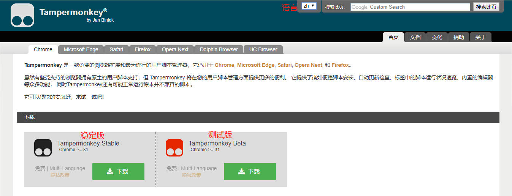
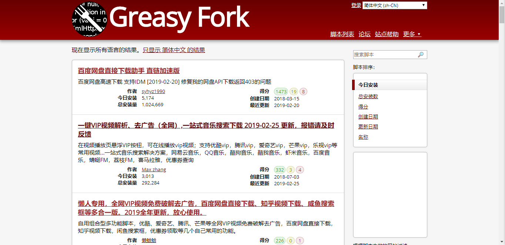
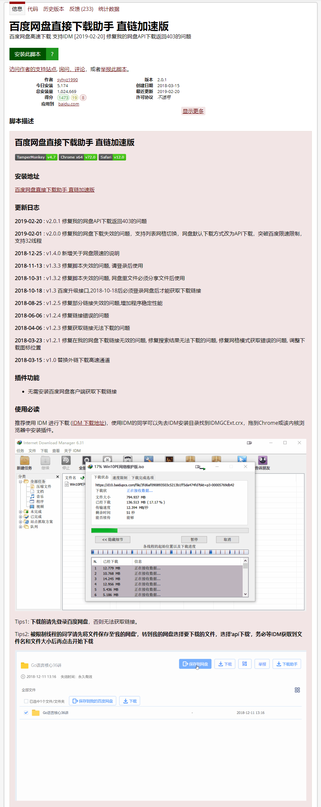
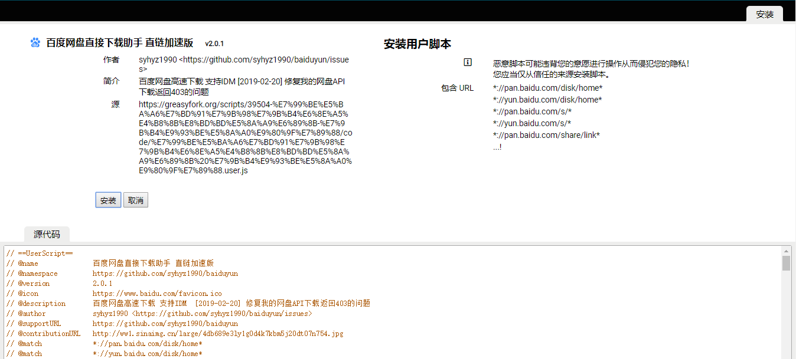
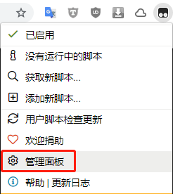
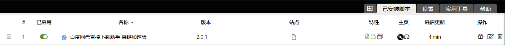
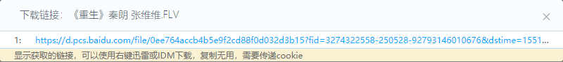

#### 这啥玩意儿？
　　首先来介绍一下 Tampermonkey，俗称"油猴"，是一款在浏览器上运行和管理脚本的插件。
　　油猴的官网网址是 [我是官网](https://tampermonkey.net/) 在这里可以进行下载油猴这个插件
　　*PS：Chrome, Microsoft Edge, Safari, Opera Next, 和 Firefox都可以进行添加*
#### 脚本又是个啥东东啊？
　　所谓脚本就是一段代码，它们能够优化您的网页浏览体验。
#### 长咩鬼样子啊？

它就长下面这个鬼样子↓↓↓

#### 咋的整到浏览器里？
　　如果能正确打开上面的官网，会出现下图，然后单击下载会跳转Google商店进行安装，安装细节略过

　　如果官网打不开，Google商店也无法正常访问的话，请参照[此篇文章](https://blackga.github.io/2019/02/17/Chrome%E6%B5%8F%E8%A7%88%E5%99%A8%E6%8F%92%E4%BB%B6%E7%AF%87/)进行安装油猴插件。
#### 脚本咋的弄？
　　安装完了是不是就可以使用了？别急，还有两步操作就可以使用了。
　　首先[访问我](https://greasyfork.org/zh-CN/scripts)就会看到下图展示的样子

　　然后点击百度网盘直接下载助手，滚动鼠标会看到页面有脚本描述、更新日志和使用必读等信息。

现在点击**安装此脚本**会出现下图的情况

　　点击**安装**会⚡闪一下⚡回到刚才安脚本的页面，然后我们点击浏览器右上角的油猴，管理面板，就可以进行**查看**和**管理**已安装的脚本啦~

#### 咋的使嘞？
　　安装好了脚本，那如何使用呢？找一个他人云盘分享的文件，就会看到页面上多了一个下载助手的按钮，点击直接下载就会调用电脑已安装的下载器(例:迅雷)，点击复制链接会弹出对话框，里面展示文件链接。可以复制到下载器点击新建任务粘贴已复制的链接进行下载。

#### 其他脚本推荐
 - [AC-baidu:重定向优化百度搜狗谷歌搜索_去广告_favicon_双列](https://greasyfork.org/zh-CN/scripts/14178)
 - [百度网盘直接下载助手 直链加速版](https://greasyfork.org/zh-CN/scripts/39504)
 - [破解VIP会员视频集合](https://greasyfork.org/zh-CN/scripts/27530)
 - [Yet Another Weibo Filter 看真正想看的微博](https://greasyfork.org/zh-CN/scripts/3249)
 - [Weibo Larger Pics 新浪微博之我要看大图](https://greasyfork.org/zh-CN/scripts/5038)
 - [豆瓣资源下载大师：1秒搞定豆瓣电影|音乐|图书下载](https://greasyfork.org/zh-CN/scripts/329484)
 - [百度贴吧：不登录即可看贴](https://greasyfork.org/zh-CN/scripts/14151)
 - [贴吧页面精简](https://greasyfork.org/zh-CN/scripts/23687)
 - [懒人专用，全网VIP视频免费破解去广告，百度网盘直接下载、知乎视频下载、咸鱼搜索框等多合一版](https://greasyfork.org/zh-CN/scripts/370634)
 - [Userscript+ : 显示当前网站所有可用的UserJS脚本 Jaeger](https://greasyfork.org/zh-CN/scripts/24508)